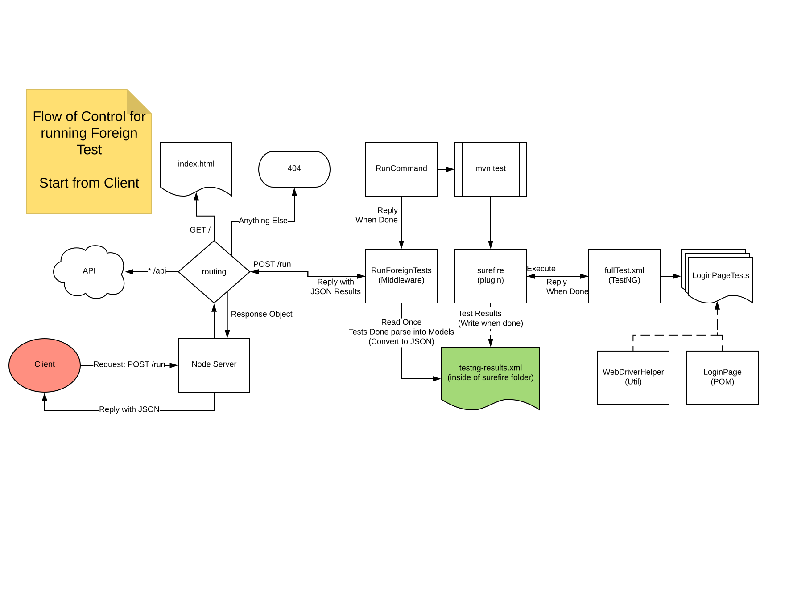

# Foreign Tests
The foreign tests are the remote tests that this application can execute.

<!-- TOC -->

- [Foreign Tests](#foreign-tests)
    - [Introduction](#introduction)
    - [Running](#running)
        - [Setup](#setup)
    - [Design](#design)
    - [Technology](#technology)
    - [Structure (Files)](#structure-files)
        - [Node.js (Server)](#nodejs-server)
        - [Java (Testing Code)](#java-testing-code)
    - [Output](#output)

<!-- /TOC -->


## Introduction
This application will not only have tests to check the functionality of the internal application but also allow remotely testing a website for which tests have been written.

This application currently tests [Assignforce](https://assignforce-client.cfapps.io)

## Running
### Setup
- Server must be currently running
    ```
    // from the root of this project
    cd frontend/server/
    node index.js
    ```

- The route **POST localhost:3001/run** will run the tests and return the results [See Output](#output)

    NOTE: *this route will not add the run into the database as of the current version but that will be added in future versions*


## Design


## Technology
The following technologies are in use for this feature

- TestNG
    - This is the runner for the application
- Selenium
    - Use of webdriver allows for remote testing of the foreign web page
- Node
    - Server used for the request and response handling in the routing
    - Using the exec function to run the test maven goal which has defined the foreign tests
- xml-js
    - Node package for parsing the XML file to construct the JSON that is being sent to the user
- Maven
    - Automation tooling that is used to trigger the tests to run on the foreign resource
- Surefire
    - Maven plugin to bootstrap the TestNG test suites to the Maven test goal


## Structure (Files)
This section describes the location and purpose for related files that are used to implement this feature.

### Node.js (Server)
- Middleware
    - location: [frontend/server/middleware/runForeignTests.js](/frontend/server/middleware/runForeignTests.js)
    - purpose: This is a function that returns a promise once resolved it will return a Javascript object with the results of the run [See Output](#output)
- Models
    - location [frontend/server/models/test.js](/frontend/server/models/test.js)
    - purpose: This is a Javascript Object to model the Test results for a single test [See Output](#output) one element of tests is a the output of this class.
- Route
    - locaiton: [frontend/server/index.js](/frontend/server/index.js)
    - purpose: This is the route that defines the POST /run route and controls the response to the requester.
- Utils
    - location: [frontend/server/utils](/frontend/server/utils)
    - purpose: This directory contains utility functions that can be reused throughout the application with no side effects
        - This feature uses the runCommand util to execute `mvn test`.

### Java (Testing Code)
- TestNG
    - TestNG XML files
        - location: [/api/src/test/java/fullTest.xml](/api/src/test/java/fullTest.xml)
        - purpose: This specifies tests to run the fullTest.xml will be used to execute all tests in the project and is currently linked to the `mvn test` goal.
    - TestNG Test Suites
        - location: [/api/src/test/java/com/revature/testng](/api/src/test/java/com/revature/testng)
        - purpose: These define the individual test suites that contain test cases with assigned group annotations for filtering.
    - POM
        - location: [/api/src/test/java/com/revature/assignforce/pages](/api/src/test/java/com/revature/assignforce/pages)
        - purpose: The page object model is used to represent the elements on a page and common actions that can be performed on the page. These files are used to make test cases for each page.
    - Selenium
        - location: [Package in POM file](/api/pom.xml)
        - purpose: Remote testing using the webdriver to emulate a user agent
- Util
    - location: [/api/src/test/java/com/revature/util](/api/src/test/java/com/revature/util)
    - purpose: Contains reusable classes with no side effects to be used throughout the application
        - This feature uses the following utils
            - [WebDriveerHelper](/api/src/test/java/com/revature/util/WebDriverHelper.java)
                - This is used to start headless browsers in tests and wait for elements to appear on the page to control execution of selenium as well as url checking for navigation verification. 


## Output
Below is a sample of the return of a passing run of the foreign tests
```
{
    "status": 1,
    "tests": [
        {
            "recordID": null,
            "BatchID": null,
            "InitiatedBy": "default",
            "status": 1,
            "signature": "setupDriver()[pri:0, instance:com.revature.testng.LoginPageTests@4cb2c100]",
            "name": "setupDriver",
            "duration_ms": 5891,
            "startTime": "2018-08-15T18:53:06Z",
            "finishTime": "2018-08-15T18:53:12Z",
            "exceptionClass": null,
            "exceptionMessage": null,
            "stackTrace": null
        },
        {
            "recordID": null,
            "BatchID": null,
            "InitiatedBy": "default",
            "status": 1,
            "signature": "managerIsAbleToLogin()[pri:0, instance:com.revature.testng.LoginPageTests@4cb2c100]",
            "name": "managerIsAbleToLogin",
            "duration_ms": 8359,
            "startTime": "2018-08-15T18:53:12Z",
            "finishTime": "2018-08-15T18:53:20Z",
            "exceptionClass": null,
            "exceptionMessage": null,
            "stackTrace": null
        },
        {
            "recordID": null,
            "BatchID": null,
            "InitiatedBy": "default",
            "status": 1,
            "signature": "closeDriver()[pri:0, instance:com.revature.testng.LoginPageTests@4cb2c100]",
            "name": "closeDriver",
            "duration_ms": 581,
            "startTime": "2018-08-15T18:53:20Z",
            "finishTime": "2018-08-15T18:53:21Z",
            "exceptionClass": null,
            "exceptionMessage": null,
            "stackTrace": null
        }
    ]
}
```

Failing run of tests will have the same shape but exception fields will be non null values. The status flag will be set to 0 if a run has one failing test.

```
{
    "status": 0,
    "tests": [
        {
            "recordID": null,
            "BatchID": null,
            "InitiatedBy": "default",
            "status": 1,
            "signature": "setupDriver()[pri:0, instance:com.revature.testng.LoginPageTests@4cb2c100]",
            "name": "setupDriver",
            "duration_ms": 13684,
            "startTime": "2018-08-15T19:09:31Z",
            "finishTime": "2018-08-15T19:09:45Z",
            "exceptionClass": null,
            "exceptionMessage": null,
            "stackTrace": null
        },
        {
            "recordID": null,
            "BatchID": null,
            "InitiatedBy": "default",
            "status": 0,
            "signature": "managerIsAbleToLogin()[pri:0, instance:com.revature.testng.LoginPageTests@4cb2c100]",
            "name": "managerIsAbleToLogin",
            "duration_ms": 18107,
            "startTime": "2018-08-15T19:09:45Z",
            "finishTime": "2018-08-15T19:10:03Z",
            "exceptionClass": "java.lang.AssertionError",
            "exceptionMessage": "Manager homepage failed to load after login / or took too long to load",
            "stackTrace": "java.lang.AssertionError: Manager homepage failed to load after login / or took too long to load\r\n\tat org.testng.Assert.fail(Assert.java:94)\r\n\tat com.revature.testng.LoginPageTests.managerIsAbleToLogin(LoginPageTests.java:33)\r\n\tat sun.reflect.NativeMethodAccessorImpl.invoke0(Native Method)\r\n\tat sun.reflect.NativeMethodAccessorImpl.invoke(NativeMethodAccessorImpl.java:62)\r\n\tat sun.reflect.DelegatingMethodAccessorImpl.invoke(DelegatingMethodAccessorImpl.java:43)\r\n\tat java.lang.reflect.Method.invoke(Method.java:498)\r\n\tat org.testng.internal.MethodInvocationHelper.invokeMethod(MethodInvocationHelper.java:80)\r\n\tat org.testng.internal.Invoker.invokeMethod(Invoker.java:714)\r\n\tat org.testng.internal.Invoker.invokeTestMethod(Invoker.java:901)\r\n\tat org.testng.internal.Invoker.invokeTestMethods(Invoker.java:1231)\r\n\tat org.testng.internal.TestMethodWorker.invokeTestMethods(TestMethodWorker.java:127)\r\n\tat org.testng.internal.TestMethodWorker.run(TestMethodWorker.java:111)\r\n\tat org.testng.TestRunner.privateRun(TestRunner.java:767)\r\n\tat org.testng.TestRunner.run(TestRunner.java:617)\r\n\tat org.testng.SuiteRunner.runTest(SuiteRunner.java:334)\r\n\tat org.testng.SuiteRunner.runSequentially(SuiteRunner.java:329)\r\n\tat org.testng.SuiteRunner.privateRun(SuiteRunner.java:291)\r\n\tat org.testng.SuiteRunner.run(SuiteRunner.java:240)\r\n\tat org.testng.SuiteRunnerWorker.runSuite(SuiteRunnerWorker.java:52)\r\n\tat org.testng.SuiteRunnerWorker.run(SuiteRunnerWorker.java:86)\r\n\tat org.testng.TestNG.runSuitesSequentially(TestNG.java:1198)\r\n\tat org.testng.TestNG.runSuitesLocally(TestNG.java:1123)\r\n\tat org.testng.TestNG.run(TestNG.java:1031)\r\n\tat org.apache.maven.surefire.testng.TestNGExecutor.run(TestNGExecutor.java:283)\r\n\tat org.apache.maven.surefire.testng.TestNGXmlTestSuite.execute(TestNGXmlTestSuite.java:75)\r\n\tat org.apache.maven.surefire.testng.TestNGProvider.invoke(TestNGProvider.java:120)\r\n\tat org.apache.maven.surefire.booter.ForkedBooter.invokeProviderInSameClassLoader(ForkedBooter.java:383)\r\n\tat org.apache.maven.surefire.booter.ForkedBooter.runSuitesInProcess(ForkedBooter.java:344)\r\n\tat org.apache.maven.surefire.booter.ForkedBooter.execute(ForkedBooter.java:125)\r\n\tat org.apache.maven.surefire.booter.ForkedBooter.main(ForkedBooter.java:417)\r\n"
        },
        {
            "recordID": null,
            "BatchID": null,
            "InitiatedBy": "default",
            "status": 1,
            "signature": "closeDriver()[pri:0, instance:com.revature.testng.LoginPageTests@4cb2c100]",
            "name": "closeDriver",
            "duration_ms": 604,
            "startTime": "2018-08-15T19:10:03Z",
            "finishTime": "2018-08-15T19:10:03Z",
            "exceptionClass": null,
            "exceptionMessage": null,
            "stackTrace": null
        }
    ]
}
```